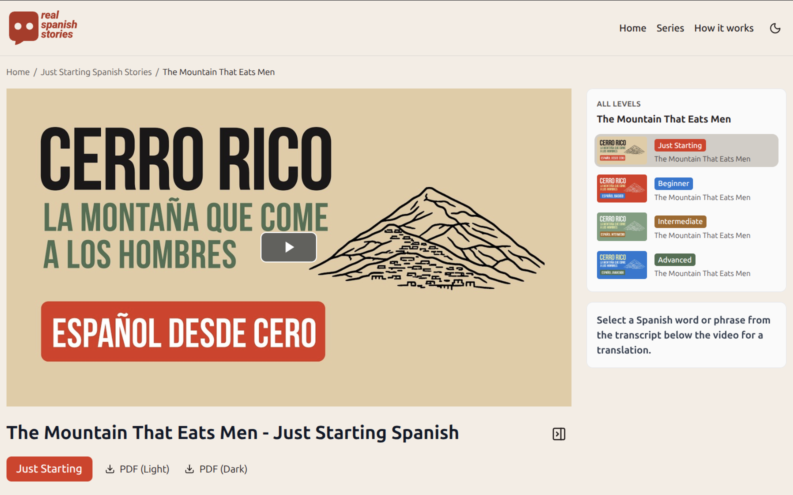

# Real Spanish Stories



A platform for learning Spanish through real historical stories with video content, translations and progress tracking, with an emphasis on learning verbs.

**Live link**: [realspanishstories.com](https://realspanishstories.com)

## Monorepo Structure

This is a **Turborepo + pnpm workspaces** monorepo.

```
apps/
  api/          — Public NestJS API (port 3001)
  admin-api/    — Admin NestJS API (port 3002)
  admin-web/    — Admin React frontend (port 3003)
  web/          — Public React frontend (port 3000)
packages/
  shared/       — Shared types, Zod schemas, Drizzle schemas, constants
  typescript-config/ — Shared TS/ESLint configs
workers/
  video-generation/  — Python worker: renders videos with MoviePy
  transcription/     — Python worker: transcribes audio with WhisperX
```

## Apps

### Public API (`apps/api`)

NestJS API serving the public-facing web app. Handles stories, users, translations, and authentication.

- **Stack**: NestJS, Drizzle ORM, Better Auth, OpenAI, Resend, AWS S3, PostgreSQL
- **Swagger docs**: `http://localhost:3001/v1/docs`

### Admin API (`apps/admin-api`)

NestJS API for content management. Handles story creation/editing, video generation, transcription, and PDF generation.

- **Stack**: NestJS, Drizzle ORM, BullMQ, Replicate, OpenAI, PDFKit, AWS S3
- **Swagger docs**: `http://localhost:3002/docs`

### Public Web (`apps/web`)

Public-facing website for browsing and translating stories.

- **Stack**: React 19, TanStack Start (SSR), TanStack Router, TanStack Query, Better Auth, shadcn/ui, video.js, Zustand, Tailwind CSS

### Admin Web (`apps/admin-web`)

Admin dashboard for creating videos from audio files and story entries in the database.

- **Stack**: React 19, TanStack Router, TanStack Query, React Hook Form, Radix UI, Tailwind CSS

## Workers

Python workers that consume BullMQ jobs from Redis.

| Worker             | Purpose                                                                   |
| ------------------ | ------------------------------------------------------------------------- |
| `video-generation` | Downloads audio from S3, renders video with MoviePy, uploads result to S3 |
| `transcription`    | Transcribes audio using WhisperX, stores transcription JSON in PostgreSQL |

## Environment Variables

### Root `.env`

| Variable                | Description                                |
| ----------------------- | ------------------------------------------ |
| `DATABASE_URL`          | PostgreSQL connection string               |
| `OPENAI_API_KEY`        | OpenAI API key                             |
| `AWS_REGION`            | AWS region                                 |
| `S3_BUCKET`             | S3 bucket name                             |
| `AWS_ACCESS_KEY_ID`     | AWS access key                             |
| `AWS_SECRET_ACCESS_KEY` | AWS secret key                             |
| `REDIS_HOST`            | Redis host                                 |
| `REDIS_PORT`            | Redis port                                 |
| `NODE_ENV`              | Environment (`development` / `production`) |

### `apps/api/.env`

| Variable             | Description                |
| -------------------- | -------------------------- |
| `PORT`               | API port (default: `3001`) |
| `BETTER_AUTH_URL`    | Better Auth base URL       |
| `BETTER_AUTH_SECRET` | Better Auth secret key     |

### `apps/admin-api/.env`

| Variable              | Description                            |
| --------------------- | -------------------------------------- |
| `PORT`                | API port (default: `3002`)             |
| `REPLICATE_API_TOKEN` | Replicate API token (video generation) |

### `apps/web/.env`

| Variable                | Description                                       |
| ----------------------- | ------------------------------------------------- |
| `VITE_API_URL`          | Public API URL (e.g. `http://localhost:3001/v1/`) |
| `VITE_AUTH_URL`         | Auth URL (e.g. `http://localhost:3001`)           |
| `VITE_UMAMI_WEBSITE_ID` | Umami analytics ID (optional)                     |

See `.env.example` files in each app for reference values.

## Development

### Prerequisites

- Node.js
- pnpm
- Docker (for Redis and Python workers)

### Setup

```bash
# Install dependencies
pnpm install

# Copy env files and fill in values
cp .env.example .env
cp apps/api/.env.example apps/api/.env
cp apps/admin-api/.env.example apps/admin-api/.env
cp apps/web/.env.example apps/web/.env

# Start Redis + workers
docker compose up -d

# Build shared package
pnpm --filter @real-spanish-stories/shared build

# Start all dev servers
pnpm dev
```

### Services

| Service              | URL                           |
| -------------------- | ----------------------------- |
| Public Web           | http://localhost:3000         |
| Public API (Swagger) | http://localhost:3001/v1/docs |
| Admin Web            | http://localhost:3003         |
| Admin API (Swagger)  | http://localhost:3002/docs    |
| RedisInsight         | http://localhost:5540         |

## Deployments

Both the public API and public web app deploy automatically via GitHub Actions on push to `main`.

| Workflow         | Trigger                                   | Target                        |
| ---------------- | ----------------------------------------- | ----------------------------- |
| `deploy.yml`     | Changes to `apps/api/**` or `packages/**` | AWS Lightsail (containerized) |
| `deploy-web.yml` | Changes to `apps/web/**` or `packages/**` | AWS Lightsail (containerized) |

Both workflows can also be triggered manually via `workflow_dispatch`. The admin API and admin web are not yet deployed.
